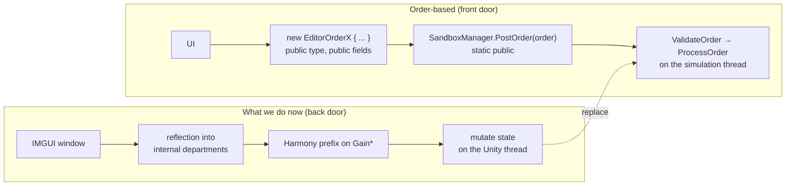
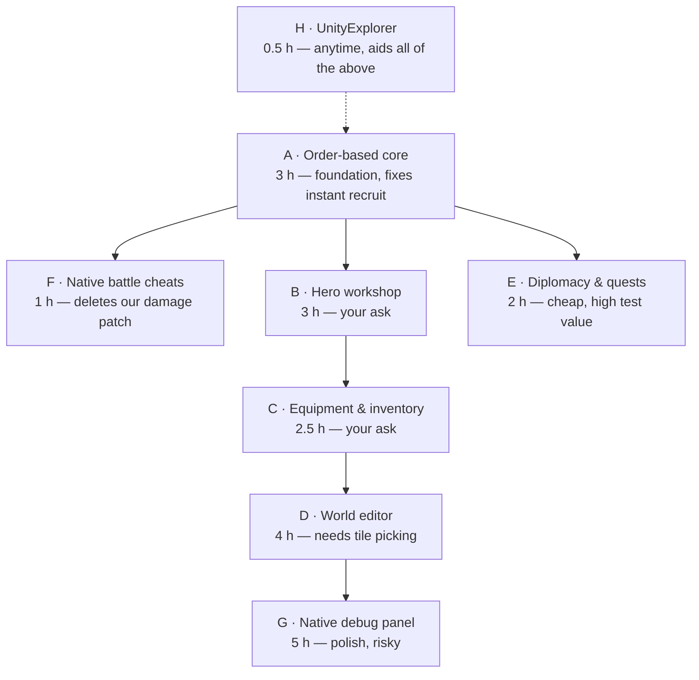

# EndlessLegent2Mods — capability options from the game's own code — 2026-09-18

> Research deliverable. What ENDLESS Legend 2 (V1.0.116) already exposes, what other tooling exists, and
> the options worth building. Nothing here is implemented yet — this is the menu to choose from.

## 1. The headline finding

**Amplitude shipped their internal game editor in the retail build.** It is not stripped, not `#if DEBUG`'d out,
and — critically — **it is `public`**.

| Surface                                                                        | What it is                                        | Size           | Visibility              |
| ------------------------------------------------------------------------------ | ------------------------------------------------- | -------------- | ----------------------- |
| `Amplitude.Mercury.Interop.EditorOrder*`                                       | Amplitude's in-house map/scenario editor commands | **~110 types** | `public`, public fields |
| `Amplitude.Mercury.Interop.Order*` incl. `OrderGiveGod*`                       | The normal gameplay order set + god/cheat orders  | ~40 relevant   | `public`                |
| `SandboxManager.PostOrder(Order)` / `PostOrder(EditorOrder)`                   | The single dispatch entry point                   | 1 method       | **`static public`**     |
| `EditorOrderProcessors.ValidateOrder / ProcessOrder`                           | Validation + execution on the simulation thread   | —              | `static public`         |
| `Amplitude.Mercury.BattleDebug.SetCheat(BattleCheatType, bool, bool)`          | 7 real battle cheats, persisted to registry       | 7 cheats       | `static`                |
| `Amplitude.DebugOverlay.dll` → `DebugPanel`, `[DebugPanel]`, `IDebugPanelInfo` | Amplitude's own debug-panel UI framework          | framework      | `public`                |

The battle cheats are literally named: `IgnoreEmpirePlaying`, `IgnoreZoneOfControl`, `IgnoreRoundCount`,
`InfiniteMovement`, `LineOfSightDebug`, `InfiniteBattleSkill`, `InfiniteActionToken`.

### Why this matters more than "more cheats"

Our current plugin reaches into **internal** department methods by reflection and Harmony-patches `GainMoney` /
`GainInfluence` / `GainResearch` / `ComputeProductionIncome`. That works, but it is the back door: we mutate
simulation state from the Unity thread, outside the game's validation, and every future patch can rename a member
under us.

The order system is the **front door the developers themselves used**:

Concretely it buys: compile-time types instead of string lookups (we can reference
`Amplitude.Mercury.Firstpass.dll` directly), the game's own validation, execution on the correct thread,
multiplayer/hot-seat awareness (`PostOrder(order, empireIndex)`), and survival across patches — Amplitude renames
internals freely but their editor order contract is stable.

## 2. What the orders actually give us

Grouped by the thing you would want to test.

### Economy & empire

`EditorOrderSetMoneyStock{EmpireIndex, MoneyStock}` · `EditorOrderSetInfluenceStock` ·
`OrderGiveGodResource{ResourceType, QuantityOfResources}` · `OrderGiveGodEmpireGaugeStock` ·
`EditorOrderSetGodCityCap{EmpireIndex, CityCap}` · `EditorOrderResetEmpireActionsCooldown`

**Set** rather than add — a stock you can type a number into, instead of pressing +10,000 six times.

### Research

`EditorOrderCompleteAllTechnology{EmpireIndex, EraIndex}` · `EditorOrderCompleteTechnology{EmpireIndex, TechnologyName}` ·
`EditorOrderEnqueueTechnology` · `EditorOrderClearTechnologyQueue`

### Instant build / instant recruit ← _the thing we were faking_

`OrderCompleteConstructionAt{SettlementGUID, ConstructionIndex}` — completes a queued item **free, now**.
`OrderCompleteAvailableConstruction` · `OrderCompleteEmpireWideConstruction` ·
`OrderBuyoutConstructionAt{..., CurrencyTypes}` · `OrderBuyoutPopulationWithMoney` / `WithCadavers`

Units are constructions in EL2, so this **is** instant recruit. Strictly better than our Industry ×1000 patch:
no waiting a turn, no cost, no overflow ceiling.

### Heroes

| Want                            | Order                                                                                                  |
| ------------------------------- | ------------------------------------------------------------------------------------------------------ |
| Draw N heroes at a chosen level | `EditorOrderForceCreateHeroDraw{MajorEmpireIndex, NumberOfHeroes, MinLevel, MaxLevel}`                 |
| Recruit from the draw / market  | `OrderHeroRecruitInDraw{HeroIndex}` · `OrderHeroRecruitInMarketplace{HeroIndex}`                       |
| Spawn a _named_ hero            | `EditorOrderForceHeroSpawn{HeroDefinition, EmpireIndex, TileIndex}` · `EditorOrderForceWorldHeroSpawn` |
| Add stat / skill points         | `OrderHeroStatisticIncrease{HeroIndex, uint[] DeltaPerHeroStatisticIndex}`                             |
| Activate a skill in the tree    | `OrderHeroSkillActivate{HeroIndex, SkillIndex}`                                                        |
| Level (XP)                      | `OrderChangeUnitsXP{UnitCollectionGUID, UnitGUIDs[], UnitsExperiencePoints[]}`                         |
| Heal / deploy / dismiss         | `OrderHeroHeal{HeroIndex}` · `EditorOrderForceHeroDeployAt` · `OrderHeroDismiss`                       |

**Every hero order is keyed by `HeroIndex`** — so "one hero or all heroes" is exactly the loop you choose to
write. One index = that hero; iterate the roster = all of them. `OrderChangeUnitsXP` takes _arrays_, so multiple
heroes level in a single order.

### Equipment / inventory

`OrderForceAddEquipment{HeroEquipmentName}` — conjure **any** of the **177** `HeroEquipment_Definition` entries.
`OrderHeroEquip{EquipmentUniqueID, HeroIndex}` · `OrderHeroUnequip{HeroEquipmentSlot, HeroIndex}` ·
`OrderSellEquipment` · `OrderMeltEquipment` · `EditorOrderClearAllEquipment{EmpireIndex}` ·
`OrderBuyEquipmentInMarketplace`

Catalogue sizes from the data export: **177 equipment** · 4 rarities · 10 types · 15 sets · ~75 hero definitions ·
180 hero skills · 8 hero classes. All name-addressable, so the UI can offer real dropdowns rather than free text.

### World editor

`EditorOrderCreateArmyAt{EmpireIndex, UnitDefinitionName, TileIndex}` · `EditorOrderAddUnitToArmy` ·
`EditorOrderTeleportArmy` · `EditorOrderSetGodSpeed{ArmyGUID, Speed}` · `EditorOrderSetArmyMovementRatio` ·
`EditorOrderCreateCityAt` / `CreateCampAt` / `CreateVillageAt` / `CreateDistrictAt` / `CreateArtificialWonderAt` ·
`EditorOrderDestroyArmy` / `DestroySettlement` · `EditorOrderAddOrRemovePopulation` ·
`EditorOrderSetExploration{EmpireIndex, TileIndexes[], Set}` ← **reveal the map** ·
`EditorOrderCollectAllCuriosities` · `EditorOrderPlantForest` / `CutForest` / `ClearMountain` / `BuildBridge` / `BuildDam`

### Diplomacy, quests, narrative

`EditorOrderForceWar` / `ForcePeace` / `ForceAllGenericTreaties` / `ForceSurrenderOffer` ·
`EditorOrderMeetEverybody{EmpireIndex}` · `EditorOrderChangeGodWarScore` · `OrderChangeGodPowerBalance` ·
`OrderChangeGodPublicOpinion` · `EditorOrderForceQuestStart` / `ForceQuestNextStep` · `EditorOrderForceStartDialog` ·
`EditorOrderForceMoodMessage` · `EditorOrderSelectEndGameVictoryPath` · `EditorOrderPacifyAllMinorEmpires`

### Battle

`BattleDebug.SetCheat(BattleCheatType, value, writeRegistry)` — the seven native cheats above.
`EditorOrderDamageUnits` · `OrderBattleAutoResolve`.
Note `writeRegistry: true` **persists the cheat across sessions** — a footgun worth defaulting to `false`.

### The one that changes everything else

`EditorOrderChangeLocalEmpire{EmpireIndex}` — **switch which empire you are playing**. That turns the console from
a cheat menu into a genuine test harness: set up a situation as empire 0, swap to empire 2, watch the AI's side.

## 3. What is _not_ there

Honest boundaries, so nothing below over-promises:

- **No shipped gameplay debug panels.** The `DebugPanel` framework is live, but only 7 classes carry
  `[DebugPanel]` and they are all framework/rendering (`Application`, `InputManager`, `GlyphAuditWindow`,
  `RenderPipelineAuditWindow`). Amplitude's simulation panels were stripped. We can register our own — the
  framework does not care who supplies the panel — but there is no hidden dev console to simply unlock.
- **No developer console / command line.** `Amplitude.ConsoleCommon.dll` is Xbox/PlayStation _storage_
  (`ConsoleStorageContainer`), not a text console. Nothing accepts typed commands.
- **No cheat keybind to enable.** `BattleDebug` has a registry-backed flag set, but no shipped UI to toggle it.

## 4. External tooling

The EL2 ecosystem is ~1 day old (full release 2026-09-17), so there is almost nothing to reuse.

| Tool                                                                         | Verdict                                                                                                                                                                                                                                                                                                                                                                                                                                                        |
| ---------------------------------------------------------------------------- | -------------------------------------------------------------------------------------------------------------------------------------------------------------------------------------------------------------------------------------------------------------------------------------------------------------------------------------------------------------------------------------------------------------------------------------------------------------- |
| **Nexus "EL2 Resource Manager"** (`com.yourname.el2resourcemanager`, v1.3.0) | The only EL2 mod on Nexus. Patches the same `Gain*` methods we do — a strict subset of ours. Our plugin now declares `[BepInIncompatibility]` on it. **Keep parked.**                                                                                                                                                                                                                                                                                          |
| **UnityExplorer** (Mono build)                                               | **Worth installing as a dev tool.** The game is Unity 6000.3.18 **Mono** (not IL2CPP), which is the well-supported case. Gives a live object browser — inspect `Sandbox`, read the real hero roster, find `HeroIndex` values and tile indices without guessing. Caveat: Unity 6 support is fork-dependent; the maintained forks list Unity 6 handling, the original sinai-dev build tops out around 2021. Try a fork; treat as disposable if it does not load. |
| **BepInEx ConfigurationManager**                                             | Gives every plugin an F1 settings UI. Low value for us — our window already edits its own config, and the plugin is the UI.                                                                                                                                                                                                                                                                                                                                    |
| **RuntimeUnityEditor**                                                       | Same niche as UnityExplorer, pick one.                                                                                                                                                                                                                                                                                                                                                                                                                         |
| **Amplitude Mod Authoring Toolkit**                                          | Official, needed only for Steam Workshop upload of the _data_ mod. Not installed here; out of band.                                                                                                                                                                                                                                                                                                                                                            |
| **BepInEx 6**                                                                | Do not. BepInEx 5 is the recommendation for Mono games until BepInEx 6 Mono support stabilises, and 5.4.23.5 is already working.                                                                                                                                                                                                                                                                                                                               |

## 5. Options

Estimates follow `ESTIMATION_GUIDELINES.md`. The codebase is mature for this work (plugin scaffold, build script,
Cecil workflow, export index all exist), so the reuse factor is high.

| #     | Option                          | What you get                                                                                                                                                                                                                  | Depends on | With Claude | Without |
| ----- | ------------------------------- | ----------------------------------------------------------------------------------------------------------------------------------------------------------------------------------------------------------------------------- | ---------- | ----------- | ------- |
| **A** | **Order-based core**            | Reference `Firstpass.dll`; replace reflection + Gain* patches with posted orders. Typed, validated, patch-durable. Set-a-number stocks instead of +10k buttons. Free instant build/recruit via `OrderCompleteConstructionAt`. | —          | **3 h**     | 12 h    |
| **B** | **Hero workshop**               | Draw N heroes at level X · recruit all · spawn any of ~75 named heroes · add stat/skill points · level via XP · heal · deploy. Target **one hero, selected heroes, or the whole roster**.                                     | A          | **3 h**     | 14 h    |
| **C** | **Equipment & inventory**       | Add any of 177 equipment by name, filtered by rarity/type/set · equip to a chosen hero + slot · clear all · melt/sell.                                                                                                        | A, B       | **2.5 h**   | 10 h    |
| **D** | **World editor**                | Spawn armies/cities/districts/wonders at a tile · teleport · god speed · reveal map · collect all curiosities · terraform · destroy. Needs tile picking (click-to-target).                                                    | A          | **4 h**     | 18 h    |
| **E** | **Diplomacy & quests**          | Force war/peace/treaties · meet everybody · war score · force quest start/next step · pick victory path · **switch local empire**.                                                                                            | A          | **2 h**     | 8 h     |
| **F** | **Native battle cheats**        | The 7 `BattleDebug` cheats as real toggles (infinite movement, ignore ZoC, infinite action tokens…) replacing our damage patch.                                                                                               | —          | **1 h**     | 4 h     |
| **G** | **Native debug-panel UI**       | Re-skin the console as an Amplitude `DebugPanel` — game-native look, docking, pinning, persisted position, no IMGUI scaling problems. Higher risk: undocumented `UIPanel` lifecycle.                                          | A          | **5 h**     | 20 h    |
| **H** | **UnityExplorer as a dev tool** | Live inspector for discovery. Not shipped with our mod.                                                                                                                                                                       | —          | **0.5 h**   | 1 h     |
| **I** | **Data-mod parity** (Workshop)  | Port whatever is portable back to the JSON mod so there is a shareable no-injection variant.                                                                                                                                  | A–F        | **3 h**     | 10 h    |

### Recommended sequence

**A → F → B → C** is the spine: 9.5 h, and it delivers every feature asked for (heroes, equipment, instant
recruit) on an architecture that stops fighting the game. E is a cheap add. D and G are the ambitious tail.

## 6. Risks

| Risk                                                                           | Likelihood      | Mitigation                                                                                                                   |
| ------------------------------------------------------------------------------ | --------------- | ---------------------------------------------------------------------------------------------------------------------------- |
| Editor orders assert or desync when posted outside the editor's own flow       | medium          | `ValidateOrder` first and check the result; wrap each post; start with read-only/no-op orders to prove the path              |
| `SimulationEntityGUID` / `HeroIndex` / tile index are hard to obtain from a UI | medium          | This is exactly what UnityExplorer (H) is for; also `Sandbox.LocalEmpire` already resolves, and heroes are an indexed roster |
| Referencing `Firstpass.dll` breaks on a game patch                             | low             | Same exposure as today's reflection, but it fails at _build_ time (loud) instead of at runtime (silent)                      |
| `BattleDebug.SetCheat(writeRegistry: true)` persists cheats beyond the session | certain if used | Always pass `false`; expose a "clear" that calls `DeactivateCheats()`                                                        |
| Order posting on the wrong thread                                              | medium          | `PostOrder` is the thread-safe queue — that is the point of using it; never call `Process*` directly                         |
| Editor orders are unvalidated against a _loaded save_                          | low             | Same new-game discipline the data mod already documents                                                                      |

## 7. Open questions for Angelo

1. **Scope** — take the recommended spine (A→F→B→C, ~9.5 h), or add E, or go all the way through D/G?
2. **Hero targeting UI** — a hero dropdown (pick one) plus an "apply to all" checkbox, or a multi-select list?
3. **Keep the Gain\* patches?** The yield multipliers (×2…×1000 per turn) have no order equivalent — orders _set_
   a stock, they do not scale income. Recommend keeping the multiplier patches and moving everything else to orders.
4. **UnityExplorer** — install it as a local dev aid?
