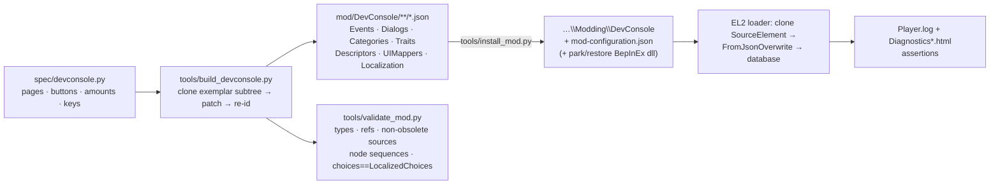
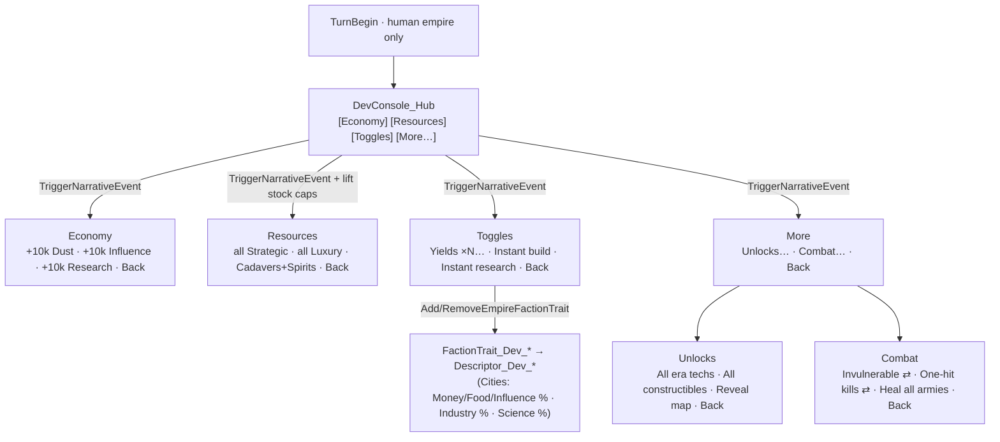
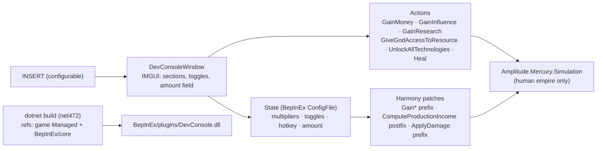

# EndlessLegent2Mods — Dev Console data mod — 2026-09-18

> Whole-feature plan (every phase in this one document). After approval it is copied to
> `C:\Users\Angelo\Desktop\Work\EndlessLegent2Mods\docs\plans\EndlessLegent2Mods-devconsole-data-mod-2026-09-18.md`
> and rendered with `plan-to-html.sh` (plan mode allows writing only this file).
> Reviewed by a 3-agent read-only critique (architect · data-format · gameplay lenses, 44 findings); every
> blocker and major is folded in below.

**Tier T2 (score 6)** — files 3 · domains 1 · keyword "add" 1 · risk 1 (game data only). Primary thread builds;
one bounded ultracode Workflow verifies generated assets against the export after the generator lands.

## 1. Context

Angelo wants an **in-game developer console** for ENDLESS Legend 2 to test features: add Dust / Influence /
Research / every strategic, luxury and special resource on demand; toggle infinite yields, instant construction
and instant research; unlock techs / constructibles / vision; later, combat cheats.

Binding constraint: **no BepInEx, no code injection — the official data-mod path only**
(`ModdingGuide_EL2_1.1.pdf`: JSON assets under `%localappdata%\Amplitude Studios\Endless Legend 2\Modding\<Mod>\`).

What the research (export `Public\ModdableAssets\assets_data.zip`, 31,297 files; `Amplitude.Framework.dll` read
with Mono.Cecil; critique scans of all 391 `NarrativeEventDefinition`s) established:

- A data mod cannot draw widgets, but a **NarrativeEventDefinition + DialogDefinition** pair renders an event
  dialog whose `DialogChoice` step shows up to 4 buttons (base-game max: `Common_Tidefall_Event003`), each firing
  `SimulationEventEffect_*` instantly: `AddOrRemoveMoney` (330 uses) · `AddOrRemoveInfluence` (94) ·
  `AddOrRemoveResource` (144) · `AddResearch` (96) · `AddEmpirePermanentFactionTrait` / `RemoveEmpireFactionTrait`
  (reversible toggles) · `UnlockEraTechnologies` · `UnlockConstructible` · `TriggerNarrativeEvent` (paging).
- **Every visible event** in the base game has an `EventDialog` and every visible choice a `ChoiceDialog`
  (158/158 and 469/469); events without them live only in `NoUI=true` categories or are obsolete.
- Live recurring `TurnBegin` events exist (`Council_CityManagement_Event001–005`, `Relationship_DenLocation_*`):
  `ConsumeEventUponTrigger=false, PreventEventRemoval=false`, paced only by their category dead zone. The only
  `PreventEventRemoval=true` TurnBegin events are **obsolete** — that flag is an assumption to measure, not a fact.
- Yield multipliers copy the game's difficulty pattern: descriptor on `MajorEmpire`, path `Cities`,
  `IndustryGain / MoneyGain / ScienceGain / InfluenceGain / FoodGain`, `ToTargetOperation 4` (Percent),
  `RawValue 1000 = +100 %`. `FixedPoint.RawValue` is **Int32** → ×5000 (raw 4,999,000) and +999,900 %
  (raw 999,900,000) fit; any stock caps at ≈ 2,147,483 units.
- `Tag_Empire_Major` caps every strategic/luxury stock at **40** (`ResourceNNMaxStock` raw 40000); adding 10,000
  is clamped unless a cap-lift descriptor is applied first. Effect `Resource` index comes from the definitions'
  `ResourceType` field: strategic **0–5**, luxury **10–25**, Corpse/Cadavers **26**, Spirit **27** (UIMapper names are 1-based — never derive indexes from them).
- Loader contract (Cecil): mod root `<GameDirectory>\Modding`; `mod-configuration.json` = JSON **array of folder
  names**; `mod-info.json` = `{DisplayName, Description, Author, Version, GameVersion, Guid, SteamWorkshopId}`;
  `*.json` discovered **recursively**; element name = file name; `SourceElementName` = element to clone
  (empty = overwrite); `Type.GetType(AssetTypeName)` must resolve; the clone's Odin `SerializationNodes` are
  **replaced wholesale** by `JsonUtility.FromJsonOverwrite` → node-serialized fields must be emitted in full,
  plain fields not present in the file are inherited from the source. Strings: `<lang>.json`, fallback `en-US.json`
  (`%` is part of the key; raw text renders as-is). Success: `Player.log` →
  `[Modification] Modding is enabled with N active modifications.`; UI/data errors →
  `%localappdata%\Amplitude Studios\Endless Legend 2\Temporary Files\Diagnostics*.html` (`[UI] Could not find UIMapper …`).
- `BepInEx/plugins/EL2_ResourceMod.dll` (Hybrid V7) patches the same yields — parked during testing.

## 2. Decisions of record (grill round, 2026-09-18)

| Question       | Answer (binding AC)                                                                                                                                                                     |
| -------------- | --------------------------------------------------------------------------------------------------------------------------------------------------------------------------------------- |
| Console shape  | **Hub + pages** — one "Dev Console" event every turn, human only; pages opened via `TriggerNarrativeEvent`                                                                              |
| Pages in scope | **Economy**, **Resources**, **Toggles**, **Unlocks** + **Phase-2 Combat** page                                                                                                          |
| Step per press | **+10,000** Dust / Influence / Research / each resource                                                                                                                                 |
| Workspace      | **git init** the mod folder · **park** `EL2_ResourceMod.dll` during testing · **Workshop-ready** `mod-info` + preview                                                                   |
| Not in scope   | Any code plugin; sliders / free-text amounts; AI empires seeing the console; Fame/Score multiplier (no `*Gain` property exists — stretch only if a `Score` descriptor pattern is found) |

Assumptions printed (not asked): mod folder `DevConsole`; `en-US` strings only; base-game elements are never
overwritten — the mod adds **new** elements only (`Dev`/`DevConsole_` prefixes; 0 collisions among 19,785 names);
console appears as a normal event notification; amounts use the ×1000 fixed point; ×N multipliers **add** to any
base percent (human difficulty carries no base yield percent, so ×N is exact at Normal).

## 3. Architecture





If the spike shows ≥ 5 buttons render, the hub goes flat (`[Economy][Resources][Toggles][Unlocks][Combat]`) and
the **More** page is dropped.

### Repository layout (`C:\Users\Angelo\Desktop\Work\EndlessLegent2Mods`)

```
.gitignore                       # export/, .claude/.worktree/, recordings/*.webm, docs/plans/*.html
README.md                        # what it is · install · every button · known ceilings · how to add a button
docs/plans/…                     # this plan + HTML twin (+ as-built diagram at close)
spike/                           # Phase-0 hand-authored files, kept as the reference shape (read-only after Phase 1)
spec/devconsole.py               # declarative spec: pages, buttons, effects, amounts, %keys, mod Guid (generated once, committed)
tools/build_devconsole.py        # generator (see contract)
tools/validate_mod.py            # static checks against the export zip (builds its own name→type/folder index; no separate tool)
tools/install_mod.py             # copy mod/ → Modding dir · write mod-configuration.json · --park-bepinex / --restore-bepinex · --verify (Player.log + Diagnostics grep)
mod/DevConsole/mod-info.json
mod/DevConsole/preview.jpg       # ≤ 1 MB, 1920×1080 (Phase 5)
mod/DevConsole/Events/*.json           NarrativeEventDefinition      (hub + pages)
mod/DevConsole/Dialogs/*.json          DialogDefinition              (1 per event with a DialogChoice step; 1 shared ack for ChoiceDialog)
mod/DevConsole/Categories/*.json       NarrativeEventCategoryDefinition (1 per event)
mod/DevConsole/Traits/*.json           FactionTrait                  (toggle carriers, ResourceCap, combat)
mod/DevConsole/Descriptors/*.json      Descriptor                    (yield %, cap lift, Units HP/damage)
mod/DevConsole/UIMappers/Traits/*.json      FactionTraitUIMapper     (same file name as the trait)
mod/DevConsole/UIMappers/Descriptors/*.json Amplitude.UI.UIMapper    (same file name as the descriptor)
mod/DevConsole/Localization/en-US.json
```

Generated JSON is **committed** — the mod folder must be inspectable and uploadable as-is.

### Exemplars (all live, `IsObsolete=false`; the generator owns every field that differs)

| Asset               | Exemplar (`export/…`)                                                                                                                                                                                                                                                                                                                                                                                                                                                           | Generator owns                                                                                                                                                                                                                              |
| ------------------- | ------------------------------------------------------------------------------------------------------------------------------------------------------------------------------------------------------------------------------------------------------------------------------------------------------------------------------------------------------------------------------------------------------------------------------------------------------------------------------- | ------------------------------------------------------------------------------------------------------------------------------------------------------------------------------------------------------------------------------------------- |
| Hub / page event    | `NarrativeEvents_Council_CityManagement/Council_CityManagement_Event001.json` (visible, TurnBegin, Consume=false) — 4-choice shape from `NarrativeEvents_Common/Common_Tidefall_Event003.json`                                                                                                                                                                                                                                                                                  | `IsObsolete=false`, `Category`, `EventDialog`, `Title/Description`, whole `Trigger` subtree (SimulationEvent, both flags, `Prerequisites`=[human-only], `Variables`, empty `Signature`), `Choices` (8 children each incl. trailing `Notes`) |
| Event dialog        | `Common_Tidefall_Events_DialogDefinition/Common_Tidefall_Event003.json`                                                                                                                                                                                                                                                                                                                                                                                                         | `Variables`=[Leader → `DialogCharacter_Leader_PerEmpire`], `Steps`=[`DialogCameraFocus Empire`, `DialogChoice{LocalizationKey, LocalizedChoices == Choices titles, in order}`], `variableFromNarrativeEventType` copied                     |
| Choice ack dialog   | `NarrativeEventDialog/Dialog_NarrativeEvent_Placeholder.json` (single `DialogLine`)                                                                                                                                                                                                                                                                                                                                                                                             | `LocalizationKey` → `%DevConsole_Ack`                                                                                                                                                                                                       |
| Category            | `NarrativeEventCategoryDefinition/NarrativeEventCategory_Collectible.json` (the only `NeedManualTrigger=true`)                                                                                                                                                                                                                                                                                                                                                                  | hub: `NeedManualTrigger=false, IsOptional=false, Priority=100, DeadZone=0, RefillPoolWhenEmpty=true, Inhibited=[], NoUI=false`; pages: same but `NeedManualTrigger=true`                                                                    |
| Trait               | `FactionTrait_LastLord/FactionTrait_LastLord_Chapter06AChoice02_FactionQuest.json` + its `FactionTrait_LastLordUIMappers/` mapper                                                                                                                                                                                                                                                                                                                                               | `IsAvailableForCustomFaction=false`, `Category=FactionTraitCategory_Quest`, `Cost=0`, `SimulationEventEffects`=[`ApplyDescriptor{Hidden=true}`], mapper `RawTitle/Description`, `LocalizationLines=[]`                                      |
| Yield descriptor    | `GameDifficultyDescriptor/Effect_EmpireBonus_GameDifficulty_AI_Impossible.json` `Effects[1]` (Cities)                                                                                                                                                                                                                                                                                                                                                                           | property list + `RawValue`s; `Effects[0]/[2]` (Units HP/damage) reused for combat                                                                                                                                                           |
| Descriptor UIMapper | `FactionTraitDescriptorUIMappers/Effect_LastLord_NoRebellion.json`                                                                                                                                                                                                                                                                                                                                                                                                              | keys                                                                                                                                                                                                                                        |
| Cap-lift descriptor | `EmpireTypeDescriptors/Tag_Empire_Major.json` (property names `Resource01..06MaxStock`, `Resource11..26MaxStock`, Spirit cap from `EraEffects_Descriptors/LastLord_Era*_SpiritsCap.json`)                                                                                                                                                                                                                                                                                       | `ToTargetOperation 0`, `RawValue 1000000000` per property                                                                                                                                                                                   |
| Effects             | first base use of each type (field lists verified: header `SimulationEffectDescriptionOverride, UIMapperOverride, Hidden, GainValues, TargetID` then type fields; `Amount` = `CostDefinition{Constant{RawValue}, RpnDefinitionReference{serializableElementName:null}, SourceID:"Empire", TargetID:null, ShowTargets:true}`; `AddOrRemoveResource` adds `int Resource`; `TriggerNarrativeEvent` adds `NarrativeEventCategory` ref; `UnlockEraTechnologies` adds `int EraIndex`) | values only                                                                                                                                                                                                                                 |

### Generator contract (`tools/build_devconsole.py`)

- Parse each exemplar's `SerializationNodes` into a **tree**; builders are `clone_subtree(exemplar, type_suffix)` +
  `patch(path, value)`; the serializer re-assigns `N|Type` ids **sequentially, reference types only** — struct
  types never carry ids (`DatatableElementReference`, `FixedPoint`, `Guid`, `UITexture`, `NarrativeEventPrerequisite`,
  `CostDefinition`, `Description.Path`, `Description.Validation`, `AI.Gain`). Odin ignores unknown member names
  silently, so no hand-typed field lists: every node comes from a base subtree.
- Round-trip test: parse → serialize three base files (`Council_CityManagement_Event001`, `Common_Tidefall_Event003`
  dialog, `FactionTrait_LastLord_Chapter06AChoice02_FactionQuest`) → **byte-equal**.
- `choice(title_key, desc_key, effects, prerequisites=[])`: `Instant=true`, `ChoiceDialog=DevConsole_Ack`
  (or `null` if the spike proves it renders), trailing `Notes`; action buttons append `trigger_page(<own category>)`
  so repeated presses stay on the page; `Back` triggers the hub category.
- Human-only prerequisite on every event (`Trigger → SimulationEventTrigger → Prerequisites`):
  `NarrativeEventPrerequisite{EntityID:"Empire", Filter: SimulationVariableFilterEmpireIsPlayedByAI{IsInverted:true}}`
  — shape verified (181 uses), the `Empire`+`TurnBegin` combination is unattested → spike measurement.
- Toggle pairs on one slot: "ON" (prereq `SimulationVariableFilterEntityDescriptor{IsInverted:true,
MustHaveOneOfDescriptors:[Descriptor_Dev_X]}` → `AddEmpirePermanentFactionTrait`) / "OFF" (prereq not inverted →
  `RemoveEmpireFactionTrait`); mutual-exclusion precedent `NarrativeEvents_RewardEvent/…_GenericQuest_01B.json`.
  Alternate filter if needed: plural `SimulationVariableFilterEntityDescriptors{MustHaveDescriptors}`.
- Multiplier page: choosing ×N = 4 × `remove_trait` + 1 × `add_trait`; "Off" removes all four.
- Opening the Resources page also applies `FactionTrait_Dev_ResourceCap` (cap lift) — no slot spent on it.
- Localization: one dict in the spec; `en-US.json` emitted from it; the validator diffs referenced vs defined keys,
  including `DialogChoice.LocalizationKey` and `LocalizedChoices`.

### `tools/validate_mod.py` rules

`AssetTypeName` ∈ export type set · every `serializableElementName` resolves (export ∪ mod) · **`SourceElementName`
must point to an `IsObsolete=false` element** · top-level node names per type match the exemplar (`Trigger,Choices`;
`Variables,OptionalVariables,Steps`; `SimulationEventEffects`) · choice children = 8 in exemplar order ·
`len(LocalizedChoices) == len(Choices)` and same keys · ids recomputed from the stream == file · every Dev trait
`IsAvailableForCustomFaction=false` · category `InhibitedNarrativeEventCategories=[]` · resource indexes ∈
`ResourceType` values of the three `*Definition` folders · UIMapper exists for every trait and descriptor ·
referenced `%keys` == defined keys.

## 4. Phases

Every phase ends with: build → validate → `install_mod.py --verify` → launch `steam://rungameid/3407390` → new game,
human faction, first turns → in-game checklist → **quit the game** (database is read at startup only) → commit.
Owners: **Marcus** contract/arbitration · **Ravi** spike files, generator, assets · **Maya** validator + in-game
verification · **Elena** README/strings · **Ari** as-built diagram (inline, embedded).

| #   | Phase                                                              | Deliverable                                                                                                                                                                                                                                                                                                                                                                                                                                                                                                        | Verification                                                                                                                                                                                                                                                                                                                                                                                                                                                                                                                                                                                                                                                                    | With Claude | Without                     |
| --- | ------------------------------------------------------------------ | ------------------------------------------------------------------------------------------------------------------------------------------------------------------------------------------------------------------------------------------------------------------------------------------------------------------------------------------------------------------------------------------------------------------------------------------------------------------------------------------------------------------ | ------------------------------------------------------------------------------------------------------------------------------------------------------------------------------------------------------------------------------------------------------------------------------------------------------------------------------------------------------------------------------------------------------------------------------------------------------------------------------------------------------------------------------------------------------------------------------------------------------------------------------------------------------------------------------- | ----------- | --------------------------- |
| 0   | **Spike A — hand-authored, prove the pipeline** (no generator yet) | `git init` + `.gitignore`; `install_mod.py` (copy, `mod-configuration.json`, `--park-bepinex` → `BepInEx/plugins.disabled/`, `--verify`); `spike/`: `mod-info.json`, hub event (4 buttons: **+10k Dust**, **Open test page**, **+10k Influence**, **Close**), hub dialog, hub category, test-page event/dialog/category (1 button **Back**), shared ack dialog; raw-text strings (no `en-US.json`)                                                                                                                 | `Player.log` `Modding is enabled with 1 active modifications`, no `LoadModificationException`; newest `Diagnostics*.html` has no `Could not find` for any spike element; in-game: event shows turn 1–2 with 4 buttons; Dust +10,000 on press; page opens **immediately** on click; Back returns; console **recurs next turn**; AI empire shows no such event (2-slot game, inspect AI via diplomacy/turn log); **measurements**: max buttons rendered (add a 5th/6th in a second run), does dismissing keep the notification, `ChoiceDialog=null` renders?, does `PreventEventRemoval=true` change anything vs `false`, do base Common/Council events still fire over ~15 turns | 2 h         | 8 h                         |
| 0b  | **Spike B — toggle + cap lift**                                    | trait + descriptor + both UIMappers for **Yields ×1000**; ON/OFF pair on one slot via choice prerequisites; `FactionTrait_Dev_ResourceCap`; a **+10k Titanium** button with and without the cap trait                                                                                                                                                                                                                                                                                                              | ON → Dust income in the empire tooltip ≈ ×1000 → OFF → baseline; only one of ON/OFF visible at a time; Titanium clamps at 40 without the cap trait and reaches 10,040 with it                                                                                                                                                                                                                                                                                                                                                                                                                                                                                                   | 1.5 h       | 6 h                         |
| 1   | Generator + validator from the proven shape                        | `spec/devconsole.py`, `build_devconsole.py` (tree clone/patch/re-id), `validate_mod.py`, round-trip byte-equality tests; regenerate Spike A/B and diff → identical behaviour in-game                                                                                                                                                                                                                                                                                                                               | tests green; regenerated spike == hand files modulo intended edits; in-game re-check                                                                                                                                                                                                                                                                                                                                                                                                                                                                                                                                                                                            | 2.5 h       | 10 h                        |
| 2   | Hub + Economy · Resources · More · Unlocks pages                   | Economy (+10k Dust / Influence / Research); Resources (+10k ×6 strategic idx 0–5 · ×16 luxury idx 10–25 · Cadavers 26 + Spirit 27; cap lift applied on page open); Unlocks (`UnlockEraTechnologies` one effect per era index found in `Era*` definitions · `UnlockConstructible` list = common `DistrictImprovementDefinition` set · Reveal map via `NarrativeEventVariable_Territories` selector-all + `GiveVision{InfiniteDuration, GiveExploration}` — **stretch: dropped if the variable form fails in-game**) | counters change in the empire/resources screen; techs unlocked; map revealed or button removed; **ultracode Workflow**: one read-only format-lens pass comparing every generated file to its exemplar and the verified field lists → fixes                                                                                                                                                                                                                                                                                                                                                                                                                                      | 2 h         | 8 h                         |
| 3   | Toggles                                                            | traits/descriptors/UIMappers for ×10/×100/×1000/×5000 (Money+Food+Influence), Instant build (`IndustryGain` +999,900 %), Instant research (`ScienceGain` +999,900 %); Toggles page + Multiplier sub-page with mutual exclusion; optional `DescriptorMapper` per descriptor if the income tooltip shows an unlabeled line                                                                                                                                                                                           | each toggle ON/OFF changes the tooltip and reverts; construction 1 turn; research completes next turn                                                                                                                                                                                                                                                                                                                                                                                                                                                                                                                                                                           | 1.5 h       | 6 h                         |
| 4   | Combat page                                                        | `FactionTrait_Dev_Invulnerable` (Units: `HealthPoints` op 4 +999,900 %), `FactionTrait_Dev_OneHit` (Units: `DamageBonusModifier` op 0 large) — trait-carried so they cover future recruits and reverse with the same toggle; **Heal all armies** via `NarrativeEventVariable_Empire_Armies{Name:"AllArmies", CollectionSelector:0}` + `HealEntity{TargetArmyID:"AllArmies", HealByRatio:true}` (spike-tested; dropped if the collection form fails)                                                                | a battle: no damage taken / one-hit kills; heal restores HP                                                                                                                                                                                                                                                                                                                                                                                                                                                                                                                                                                                                                     | 1.5 h       | 6 h                         |
| 5   | Polish, manifest, docs                                             | `en-US.json` with `<c=…>` colour codes; `preview.jpg` ≤ 1 MB; `mod-info` (DisplayName, Description, Author, Version, `GameVersion=1.0.108`, stable Guid); README (buttons, ceilings: 2,147,483 stock cap, percents add); as-built Mermaid; BepInEx park/restore note                                                                                                                                                                                                                                               | fresh install from an empty `Modding/` works; Workshop upload is **manual** via the Mod Authoring Toolkit (absent from this install — out of band)                                                                                                                                                                                                                                                                                                                                                                                                                                                                                                                              | 1 h         | 4 h                         |
| —   | Close (mandate)                                                    | `/simplify` on `tools/*.py`, `spec/`; Maya review (risk 1); dead-code scan; vault learning (Odin node recipe + loader contract + DialogChoice requirement); E2E MP4 via installed `ffmpeg 9.0` `gdigrab` → `recordings/devconsole-ingame.mp4` (console → each page → values change → toggle ON/OFF); `gauge-improvements`; restore/park decision asked                                                                                                                                                             | all steps green                                                                                                                                                                                                                                                                                                                                                                                                                                                                                                                                                                                                                                                                 | 1 h         | 4 h                         |
|     | **Total**                                                          |                                                                                                                                                                                                                                                                                                                                                                                                                                                                                                                    |                                                                                                                                                                                                                                                                                                                                                                                                                                                                                                                                                                                                                                                                                 | **13 h**    | **52 h** — ≈ 4×, 75 % saved |

Multi-file edits happen in every phase → this plan is the single approval for all of them.

### Spike decision gate (fallbacks pre-decided)

| Observation                                                  | Consequence                                                                                                                                                         |
| ------------------------------------------------------------ | ------------------------------------------------------------------------------------------------------------------------------------------------------------------- |
| Only 4 buttons render                                        | Hub = Economy / Resources / Toggles / **More…** (as drawn)                                                                                                          |
| 5+ buttons render                                            | Flat hub, drop **More**                                                                                                                                             |
| Page does not open immediately                               | Try `TriggerNarrativeEventConsequence` (direct event ref) → then flat design: every page is its own `TurnBegin` event, no Back buttons                              |
| Console does not recur with `Consume=false/Prevent=false`    | Test `Prevent=true`; then `RefillPoolWhenEmpty=true` + DZ 0 on the category; then `ConsumeEventForEmpire`-style MoodMessage pattern                                 |
| Event cannot be dismissed without a choice                   | `Back` → `Close` (no effects); hub reappears next turn                                                                                                              |
| `ChoiceDialog=null` hides the button                         | keep the shared 1-line ack dialog (default)                                                                                                                         |
| Choice prerequisites disable rather than hide                | separate **Toggles ON** / **Toggles OFF** pages                                                                                                                     |
| AI receives the console                                      | move the gate to a `NarrativeEventVariable_MajorEmpires` + `EmpireIsPlayedByAI` filter; last resort: opt-in `FactionTrait_Dev_Console` in the custom-faction editor |
| Base story events stop firing                                | hub category `Priority` 100 → 1                                                                                                                                     |
| `RemoveEmpireFactionTrait` does not undo the permanent trait | toggles become `ApplyStatusOnEmpireArmiesUnits` / statuses with `Duration=2147483647` + `RemoveStatus`, or ON-only with a README note                               |

## 5. Verification strategy

1. **Static (every build)**: `validate_mod.py` rules above; round-trip tests.
2. **Loader**: `install_mod.py --verify` after launch — greps `%localappdata%Low\Amplitude Studios\Endless Legend 2\Player.log`
   for the `[Modification]` line and `LoadModificationException | could not find source element | could not resolve type`,
   and the newest `%localappdata%\Amplitude Studios\Endless Legend 2\Temporary Files\Diagnostics*.html` for `Could not find`
   and every generated element name.
3. **In-game** (hands-on, recorded): value before → press → value after, for every button; toggles ON → tooltip →
   OFF → baseline; AI empire unaffected; base events still fire. Quit between iterations.
4. **Adversarial verification (ultracode)**: one bounded Workflow after Phase 2 (format lens: generated file vs
   exemplar + field lists). Ground truth for behaviour is the running game, not agent review.

## 6. Risks

| Risk                                                                                                        | Likelihood            | Mitigation                                                               |
| ----------------------------------------------------------------------------------------------------------- | --------------------- | ------------------------------------------------------------------------ |
| A dialog/choice shape detail wrong → buttons don't render                                                   | medium                | spikes first; exemplar subtree cloning; `LocalizedChoices==Choices` rule |
| Paging semantics differ (`TriggerNarrativeEvent` has 1 base use, from a loot table)                         | medium                | gate row with 3-step ladder                                              |
| Human-only gate unattested on `Empire`+`TurnBegin`                                                          | medium                | spike measurement + gate row                                             |
| Stock caps clamp resources at 40                                                                            | certain without fix   | cap-lift trait applied on Resources page open (Spike B proves it)        |
| Int32 ceilings (stock ≈ 2.1 M, raw values < 2^31)                                                           | known                 | README; validator asserts every emitted `RawValue` < 2,147,483,647       |
| Game patch changes type names / export path (guide says `Public\Modding`, disk has `Public\ModdableAssets`) | low                   | validator reads the current zip; README pins `GameVersion`               |
| BepInEx plugin confounds numbers                                                                            | certain if not parked | `--park-bepinex` in Spike A; state printed on every install              |
| Workshop upload tool absent                                                                                 | known                 | manual, out of band                                                      |

## 7. Deploy

Local only. Commits on `main` of the new repo after each green phase — no remote, **no push**, no PR. Install target
is the local `Modding/` directory. Workshop publishing is a manual step for Angelo.

## 8. Mandate close checklist

- [ ] `/simplify` on `tools/*.py`, `spec/devconsole.py`
- [ ] Code review (Maya; risk 1) — diff-scoped, FILES TOUCHED cross-check
- [ ] Dead-code scan `bash ~/.claude/hooks/dead-code-check.sh`
- [ ] Vault learning via `vault-append.sh` (Odin node recipe · loader contract · DialogChoice requirement · stock caps)
- [ ] E2E MP4 in `recordings/` (console → pages → values change → toggle ON/OFF), frame-verified
- [ ] `gauge-improvements` vs first commit; README + as-built Mermaid
- [ ] Ask Angelo: restore `EL2_ResourceMod.dll` or leave parked

---

# Phase B — Dev Console **plugin** (BepInEx + Harmony) — approved direction 2026-09-18

## B1. Context

The data-only console works (six every-turn events, instant effects, ~20 verified in-game presses) but the UX Angelo
wants — **one hotkey → one window with everything, toggles that apply on press, no Confirm** — is the game's dialog
code, unreachable from data. Angelo chose (AskUserQuestion, 2026-09-18) to **build our own BepInEx plugin**; the data
mod stays as the shareable Workshop variant. BepInEx 5.4.23.5 + Doorstop are already installed in the game folder;
the Nexus "EL2 Resource Manager" DLL (restored, active) proves the approach on this build and will be **parked again**
while ours is active (both would patch the same Gain methods → double multipliers).

## B2. Game API (read with Mono.Cecil, `Amplitude.Mercury.Firstpass.dll`, build V1.0.116)

| Need                              | Call / patch target                                                                                                                                                                     | Visibility                       |
| --------------------------------- | --------------------------------------------------------------------------------------------------------------------------------------------------------------------------------------- | -------------------------------- |
| Human empire(s)                   | `Sandbox.MajorEmpires` (static `MajorEmpire[]`), `Empire.IsControlledByHuman`                                                                                                           | public                           |
| +Dust                             | `DepartmentOfTheTreasury.GainMoney(FixedPoint gain, bool raiseSimulationEvent, bool isRefund)`                                                                                          | public                           |
| +Influence                        | `DepartmentOfCulture.GainInfluence(FixedPoint, bool)`                                                                                                                                   | nonpublic → `AccessTools.Method` |
| +Research                         | `DepartmentOfScience.GainResearch(FixedPoint, bool)`                                                                                                                                    | nonpublic                        |
| Unlock eras                       | `DepartmentOfScience.UnlockAllTechnologies(int eraIndex, bool)`                                                                                                                         | public                           |
| +Resources                        | `DepartmentOfResources.GiveGodAccessToResource(ResourceType, int count)` — enum `Resource01..32`, `ResourceCadaver=26`, `ResourceSpirit=27`                                             | nonpublic                        |
| Yield ×N (Dust/Influence/Science) | Harmony **prefix** on the three `Gain*` methods: `gain *= N` when `this` empire is human and toggle on                                                                                  | —                                |
| Industry ×N / instant build       | Harmony **postfix** on `DepartmentOfIndustry.ComputeProductionIncome(Settlement)` (`ref FixedPoint __result`) for human settlements                                                     | static nonpublic                 |
| Invulnerable / one-hit            | Harmony **prefix** on `BattleUnit.ApplyDamage(FixedPoint damage, BattleUnit attackerUnit, bool)`: damage→0 when target is human & toggle; damage→99,999 when attacker is human & toggle | nonpublic                        |
| Heal armies                       | `MajorEmpire.Armies` (`ReferenceCollection<Army>`) → `IDamageableEntity.SetHealthRatio(1)`                                                                                              | interface                        |
| Fixed point                       | `FixedPoint.op_Implicit(int)`; `FixedPoint * int`                                                                                                                                       | public                           |

`FixedPoint.RawValue` is Int32 → multipliers capped at ×1000 in the UI; the plugin clamps results to `int.MaxValue`.

## B3. Architecture



```
plugin/DevConsole/DevConsole.csproj     net472 class library; <Reference HintPath> to game DLLs; no NuGet at runtime
plugin/DevConsole/Plugin.cs             [BepInPlugin] entry: config, Harmony.PatchAll, hotkey, OnGUI → window
plugin/DevConsole/ConsoleState.cs       ConfigEntry-backed toggles/multipliers/amount; human-empire helper
plugin/DevConsole/Actions.cs            the six instant actions via reflection (AccessTools), each wrapped in try/log
plugin/DevConsole/Patches.cs            Harmony patch classes (Gain*, ComputeProductionIncome, ApplyDamage)
plugin/DevConsole/Window.cs             IMGUI layout: Economy / Resources / Techs / Yields / Instant / Combat
tools/build_plugin.py                   dotnet build → copy DLL to BepInEx/plugins (parks EL2_ResourceMod.dll) → tail LogOutput.log
```

Window (one screen, no pages): **Economy** [+10k Dust][+100k][+10k Influence][+100k][+10k Research][+100k] ·
**Resources** amount field + [All strategic][All luxury][Cadavers+Spirits][Everything] · **Techs** [Era I]…[Era VII]
[All] · **Yields** toggles Dust/Industry/Science/Influence with multiplier selector ×2/×10/×100/×1000 ·
**Instant** toggles Build (Industry ×1000) / Research (Science ×1000) · **Combat** toggles Invulnerable / One-hit,
[Heal all armies]. Every control applies immediately; toggles persist in `BepInEx/config/DevConsole.cfg`.

## B4. Steps

| #   | Step                                                                                                                                              | Verification                                                                                             | With Claude | Without   |
| --- | ------------------------------------------------------------------------------------------------------------------------------------------------- | -------------------------------------------------------------------------------------------------------- | ----------- | --------- |
| B0  | Toolchain: `winget install Microsoft.DotNet.SDK.8` (Angelo consented via the chosen option); `dotnet --version`                                   | SDK resolves; `dotnet build` of an empty net472 lib succeeds (reference assemblies pulled automatically) | 0.3 h       | 1 h       |
| B1  | Skeleton: csproj + Plugin.cs logging "DevConsole loaded", hotkey toggles an empty window; `build_plugin.py` parks the Nexus DLL and installs ours | `BepInEx/LogOutput.log` shows `Loading [Dev Console 0.1.0]`; INSERT shows/hides the window in game       | 0.7 h       | 3 h       |
| B2  | Actions: Economy, Resources, Techs, Heal via reflection on the **human** empire                                                                   | in game: HUD Dust/Influence jump on click; resources column; tech tree unlocked; army HP full            | 1 h         | 4 h       |
| B3  | Patches: yield multipliers + instant toggles; combat prefix                                                                                       | next turn income ×N in tooltip; construction 1 turn; battle: no damage / one-hit                         | 1 h         | 4 h       |
| B4  | Polish: config persistence, AI never affected (checked in every patch), window styling, README section, MP4 demo                                  | full checklist below                                                                                     | 0.5 h       | 2 h       |
|     | **Total**                                                                                                                                         |                                                                                                          |             | **3.5 h** | **14 h** — ≈4× |

## B5. Verification

1. `python tools/build_plugin.py` → 0 warnings-as-errors; DLL copied; `LogOutput.log` has our `[Info : Dev Console]` line and no `TypeLoadException`/`HarmonyException`.
2. In game (new or existing save — the plugin adds no data): INSERT → window; each button → HUD value changes instantly; toggles → tooltip/queue reflect ×N next turn; combat toggles in one fight; AI empire values unchanged (diplomacy screen).
3. Regression: the data mod still loads alongside (both can coexist; the plugin never touches the narrative events).

## B6. Risks

| Risk                                                              | Mitigation                                                                                                           |
| ----------------------------------------------------------------- | -------------------------------------------------------------------------------------------------------------------- |
| Method signatures differ on a future patch                        | every reflection lookup is null-checked and logged; the window disables a control whose target is missing            |
| Both plugins active → double multipliers                          | `build_plugin.py` parks `EL2_ResourceMod.dll`; README states one at a time                                           |
| `ComputeProductionIncome` is static: need the settlement's empire | `Settlement.Empire` / `EmpireIndex` via AccessTools; fallback: multiply only when `Sandbox.LocalEmpireIndex` matches |
| `BattleUnit` → owning empire lookup unknown                       | resolve at B3 via Cecil (`BattleUnit.Unit`, `Unit.Empire`); fallback: skip combat toggles, keep data-mod combat page |
| Int32 overflow at ×1000 on rich empires                           | clamp in patches; UI caps at ×1000                                                                                   |
