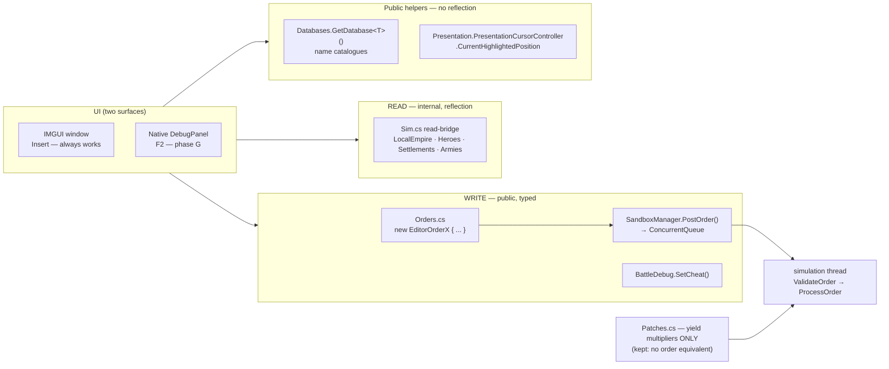

# EndlessLegent2Mods — Dev Console on the game's own order system — 2026-09-18

> Whole-feature plan (every phase in this one document). After approval it is copied to
> `docs/plans/EndlessLegent2Mods-devconsole-orders-2026-09-18.md` and rendered with `plan-to-html.sh`.
> Research backing: `docs/plans/EndlessLegent2Mods-capability-options-2026-09-18.md` + 3 read-only Cecil
> explorations (heroes/equipment · settlements/tiles · debug overlay).

**Tier T3 (score 8)** — files 7+ (3) · domains 2 (2) · keyword "redesign" (2) · risk 1 (local game mod).
Linear on the primary thread; the research dispatches are already spent. No further agent budget needed.

## 1. Context

The Dev Console plugin works (Insert → window → Dust/Influence/Research/resources/eras/heal, yield multipliers,
instant toggles). It reaches the simulation the wrong way: **reflection into `internal` department methods plus
Harmony patches on `GainMoney`/`GainInfluence`/`GainResearch`/`ComputeProductionIncome`**, mutating state from the
Unity thread outside the game's validation.

Cecil reading of V1.0.116 found that **Amplitude shipped their in-house game editor in the retail build, public**:

- **~110 `EditorOrder*`** + ~40 `Order*` DTOs in `Amplitude.Mercury.Interop` — `public`, public fields, **public
  parameterless constructors**.
- **`SandboxManager.PostOrder(Order|EditorOrder)`** — `static public`. IL: null-checks the sandbox (logs and
  returns if not ready), then `PostOrderController` → **`ConcurrentQueue<Order>.Enqueue`**. Thread-safe by
  construction, validated by `EditorOrderProcessors.ValidateOrder`, executed on the simulation thread.
- **`BattleDebug.SetCheat(BattleCheatType, bool, bool)`** — 7 real cheats (`InfiniteMovement`,
  `IgnoreZoneOfControl`, `InfiniteActionToken`, `IgnoreRoundCount`, `IgnoreEmpirePlaying`, `InfiniteBattleSkill`,
  `LineOfSightDebug`).
- **`DebugOverlayManager.get_IsEnabled` is compiled to `return false`** — a single Harmony postfix unlocks
  Amplitude's own debug-overlay UI. Prefabs ship (`DebugItem_Button/Toggle/Slider/TextField/Droplist/Label/
Foldout`), **F2 is already bound** to `ToggleDebugOverlay`, and `DebugFolders` has a `Modding` value.

Decisions taken (AskUserQuestion, 2026-09-18): build **everything A–G**; hero controls are a **dropdown +
"apply to all" checkbox**; **install UnityExplorer** as a dev aid; **keep the yield-multiplier patches** (orders
_set_ a stock, they cannot scale per-turn income — there is no order equivalent).

Outcome: every cheat runs through the developers' own front door, `instant recruit` becomes real instead of a
×1000 production fake, and the console gains heroes, equipment, a world editor, diplomacy and a native UI.

## 2. Architecture

**Writes are public and typed. Reads are internal and stay on reflection.** This split is the core insight —
`Sandbox`, `Empire`, `MajorEmpire`, `Hero`, `Settlement`, `Army` are all `internal`, but every order DTO, the
dispatcher, the cursor controller, the datatables and `StaticString`/`SimulationEntityGUID` are public.



### Key facts the implementation depends on

| Need                         | Resolution (verified)                                                                                                                                                                                                                                                                                                                                                   |
| ---------------------------- | ----------------------------------------------------------------------------------------------------------------------------------------------------------------------------------------------------------------------------------------------------------------------------------------------------------------------------------------------------------------------- |
| Post an order                | `SandboxManager.PostOrder(order)` — public static; safe pre-game (logs, returns)                                                                                                                                                                                                                                                                                        |
| Local empire                 | `SandboxManager.Sandbox` (private static) → `Sandbox.LocalEmpire` returns base `Empire`, **cast to `MajorEmpire`**                                                                                                                                                                                                                                                      |
| `HeroIndex`                  | **Global** index into `Sandbox.AcademyAncillary.Heroes`, equals `Hero.Index`. Iterate `empire.Heroes[i]` for the UI, send `hero.Index`. `ValidateOrderHeroEquip` also requires you own that hero                                                                                                                                                                        |
| Hero stat points             | `OrderHeroStatisticIncrease(int, uint[])` — array must be **exactly length 4** (`HeroStatistics.Count`); deltas are **paid from `Hero.SkillPoint`**. Trap: index 3 ("Dexterity") writes `AddedCharisma`                                                                                                                                                                 |
| Hero XP                      | `OrderChangeUnitsXP{collectionGUID, unitGUIDs[], xp[]}`; `hero.HeroUnit.Entity.GUID`, collection = `…UnitCollection.Entity.GUID`; collection must belong to your empire                                                                                                                                                                                                 |
| Equipment                    | `OrderForceAddEquipment{HeroEquipmentDefinition name}` · `OrderHeroEquip{ulong UniqueID, HeroIndex}` · `OrderHeroUnequip{HeroEquipmentSlot, HeroIndex}`. Stash: `Empire.EquipmentStash : ListOfStruct<EquipmentInfo>` (`.Data`/`.Length` public; `EquipmentInfo.UniqueID` + `.EquipmentDefinition` public). `HeroEquipmentSlot` = Weapon/Armor/Accessory/Consumable/Pet |
| Instant build / recruit      | `OrderCompleteConstructionAt{SettlementGUID, ConstructionIndex}` — **free**. Queue: `Settlement.ConstructionQueue.Entity.Constructions` (public `ListOfStruct<Construction>`). Index 0 allowed; entry must pass `ConstructibleHelper.IsValid`                                                                                                                           |
| Tile picking                 | `Amplitude.Mercury.Presentation.Presentation.PresentationCursorController.CurrentHighlightedPosition` (int tile index) + `.CurrentHighlightedPositionValidity` — **fully public**                                                                                                                                                                                       |
| Tile index == world position | Same int space; `Amplitude.Mercury.WorldPosition` is a public static class of helpers                                                                                                                                                                                                                                                                                   |
| Name catalogues              | `Databases.GetDatabase<T>(false)` → `IDatabase<T> : IEnumerable<T>`; `DatatableElement.Name : StaticString`                                                                                                                                                                                                                                                             |
| Strings                      | `new StaticString(string)` — public ctor, **no implicit operator**                                                                                                                                                                                                                                                                                                      |
| Native panel                 | Harmony postfix `DebugOverlayManager.get_IsEnabled` → `true`. Panel classes must live in an assembly whose name **starts with `Amplitude`** (`AssemblyExtension.IsAmplitudeAssembly`)                                                                                                                                                                                   |

### Proposed UI

One window, eight tabs. Every control applies on press; no confirm step. Tabs keep each screen under the
150-line file limit and stop the window growing past one screenful.

```
┌─ Dev Console ─────────────────────────────────────────── Insert to hide ─┐
│ ┌─────────┬───────┬────────┬───────────┬───────┬──────────┬────────┬────┐│
│ │ Economy │ Build │ Heroes │ Equipment │ World │ Diplomacy│ Battle │Yld ││
│ └─────────┴───────┴────────┴───────────┴───────┴──────────┴────────┴────┘│
│  Empire: The Imperium (#0)                    sandbox: alive · turn 23   │
└──────────────────────────────────────────────────────────────────────────┘
```

**Economy** — typed values, because orders _set_ a stock rather than adding to it:

```
│  Dust        [    170000 ] [Set]   [+10k] [+100k]                        │
│  Influence   [    150000 ] [Set]   [+10k] [+100k]                        │
│  Research    [         0 ] [Add]   [+10k] [+100k]                        │
│  City cap    [        99 ] [Set]                                         │
│                                                                          │
│  RESOURCES                                     amount [ 10000 ]          │
│  [All strategic] [All luxury] [Cadavers & Spirits] [Everything]          │
│                                                                          │
│  TECHNOLOGIES   Era [I][II][III][IV][V][VI][VII]        [Unlock all]     │
│  Single  [ Technology_Era3_Ballistics              ▼ ]  [Complete]       │
```

**Build** — real instant recruit, free and immediate:

```
│  Settlement  [ New Silny — city, 3 queued                 ▼ ]            │
│    1  Communal Habitations               12 turns   [Complete]           │
│    2  Vaulter Infantry                    4 turns   [Complete]           │
│    3  Militia Outpost                     8 turns   [Complete]           │
│  [Complete this queue]            [Complete EVERY settlement's queue]    │
```

**Heroes** — the dropdown + apply-to-all you chose:

```
│  HERO  [ Ulvar the Sunless — lvl 7               ▼ ]  ☐ apply to all     │
│        12 in roster · global HeroIndex #4                               │
│                                                                          │
│  LEVEL & POINTS          Level 7    XP 2400 / 3000    Skill points 3     │
│  Skill points [   10 ] [Give]                                           │
│  Strength     [ +5 ]    Intellect  [ +5 ]                               │
│  Constitution [ +5 ]    Charisma † [ +5 ]              [Apply stats]     │
│  † the game labels index 3 "Dexterity" but writes AddedCharisma          │
│  XP [ 10000 ] [Give XP]        [Heal]      [Dismiss]                    │
│                                                                          │
│  ROSTER                                                                  │
│  Draw [ 5 ] heroes at level [ 1 ]–[ 10 ]              [Create draw]      │
│  [Recruit all in draw]   [Recruit all in marketplace]                   │
│  Spawn [ Hero_LastLord_Vaulters_03    ▼ ] at hovered tile  [Spawn]      │
```

**Equipment** — 177 definitions, filtered:

```
│  HERO [ Ulvar the Sunless ▼ ]                          STASH · 38 items  │
│  ADD          rarity [ Legendary ▼ ]   type [ Weapon ▼ ]                │
│  [ HeroEquipment_Sword_Legendary_02                ▼ ]  [Add to stash]  │
│  [Add every item of this rarity]                        [Add all 177]   │
│                                                                          │
│  EQUIPPED                              STASH                             │
│   Weapon      Sunless Blade [Unequip]   Dawnfang            [Equip]     │
│   Armor       — empty —                 Kite Shield         [Equip]     │
│   Accessory   Ring of Dust  [Unequip]   Ring of Ash         [Equip]     │
│   Consumable  — empty —                 …                                │
│   Pet         — empty —                                [Clear all]      │
```

**World** — driven by the tile your mouse is over:

```
│  HOVERED TILE   #14822   ✓ valid            (move the mouse on the map)  │
│  SPAWN HERE                                                              │
│   Unit [ Unit_LastLord_Infantry_02      ▼ ]            [Spawn army]     │
│   [Create city] [Create camp] [District ▼] [Wonder ▼] [Curiosity ▼]     │
│                                                                          │
│  SELECTED ARMY   Vaulter Host                                            │
│   [Teleport here]     God speed [ 99 ] [Set]          [Destroy]         │
│                                                                          │
│  MAP   [Reveal entire map]  [Collect all curiosities]  [Plant forest]   │
```

**Diplomacy** — including playing as somebody else:

```
│  TARGET  [ #2  The Kin of Sheredyn                 ▼ ]                  │
│  [Declare war] [Force peace] [All treaties] [Force surrender]           │
│  War score [ +100 ] [Apply]                          [Meet everybody]   │
│  QUESTS  [ Quest_MainStory_04 ▼ ]  [Start] [Next step]                  │
│  Victory path [ Glorify ▼ ] [Select]                                    │
│  PLAY AS [ #2 The Kin of Sheredyn ▼ ]        [Switch local empire]      │
```

**Battle** — Amplitude's own seven, not ours:

```
│  NATIVE BATTLE CHEATS                                                    │
│   ☑ Infinite movement           ☐ Ignore round count                    │
│   ☑ Infinite action tokens      ☐ Ignore empire playing                 │
│   ☐ Ignore zone of control      ☐ Infinite battle skill                 │
│   ☐ Line of sight debug                                                  │
│  [Clear all]            not written to registry — gone when you exit    │
```

**Yields** — the Harmony patches we keep, since no order scales income:

```
│  Dust      [off][x2][x10][x100][x1000]                                  │
│  Industry  [off][x2][x10][x100][x1000]                                  │
│  Science   [off][x2][x10][x100][x1000]                                  │
│  Influence [off][x2][x10][x100][x1000]                                  │
│  ☑ Instant build     ☑ Instant research                                 │
```

Phase 7 re-renders the same content as a native Amplitude panel opened with **F2**, using the game's own
Button / Toggle / Slider / TextField / Droplist widgets, docked in the `Modding` folder. The IMGUI window above
remains available on Insert.

### Files

```
plugin/DevConsole/
  Plugin.cs              entry · hotkey · OnGUI · wiring
  State.cs               config (existing, extended)
  Sim.cs                 reflection READ bridge (existing, extended)
  Orders.cs              NEW typed order construction + Post() + Validate()
  Catalog.cs             NEW Databases.GetDatabase<T> name lists (equipment, heroes, units, techs)
  Cheats/Economy.cs      A  set stocks, resources, techs
  Cheats/Build.cs        A  instant build / instant recruit
  Cheats/Battle.cs       F  BattleDebug wrapper
  Cheats/Heroes.cs       B  roster, targeting, levels, points
  Cheats/Equipment.cs    C  stash, add, equip/unequip
  Cheats/World.cs        D  tile picking, spawn, teleport, reveal
  Cheats/Diplomacy.cs    E  war/peace, quests, local empire
  Patches.cs             yield multipliers ONLY (damage patch deleted in F)
  Ui/Window.cs           shell + tab bar (existing Window.cs split)
  Ui/Tab*.cs             one per area, ≤150 lines each
plugin/AmplitudePanels/  G  Amplitude.DevConsole.Panels.csproj — thin [DebugPanel] shim
tools/build_plugin.py    extended: builds both assemblies
```

`Ui/Window.cs` is split per the code-splitting rule (current `Window.cs` is 157 lines and would triple).

## 3. Phases

Every phase ends: build (0 warnings) → install → launch → in-game check → commit.

| #   | Phase                      | Deliverable                                                                                                                                                                                                                                                                                                                                                                                                                                                      | In-game verification                                                                                                                          | With Claude | Without                     |
| --- | -------------------------- | ---------------------------------------------------------------------------------------------------------------------------------------------------------------------------------------------------------------------------------------------------------------------------------------------------------------------------------------------------------------------------------------------------------------------------------------------------------------- | --------------------------------------------------------------------------------------------------------------------------------------------- | ----------- | --------------------------- |
| 0   | **Foundation**             | UnityExplorer (`UnityExplorer.BepInEx5.Mono.zip` v4.13.6) installed; csproj references `Amplitude.Mercury.Firstpass`, `Amplitude`, `Amplitude.UI` (all deps verified present); `Orders.cs` post/validate helper; `Catalog.cs`                                                                                                                                                                                                                                    | One harmless order posted and applied; BepInEx log clean; UnityExplorer opens                                                                 | 1.5 h       | 5 h                         |
| 1   | **A · Order core**         | Economy tab → `EditorOrderSetMoneyStock` / `SetInfluenceStock` / `OrderGiveGodResource` / `SetGodCityCap`; Research → `EditorOrderCompleteAllTechnology` / `CompleteTechnology`. **Type a number, not +10k.** `Build.cs` instant build + **instant recruit** via `OrderCompleteConstructionAt` over every settlement queue. Reflected `Actions.cs` deleted                                                                                                       | Stocks jump to the typed value; a queued unit completes free this turn; AI empires unaffected                                                 | 3 h         | 12 h                        |
| 2   | **F · Battle cheats**      | `Battle.cs` → `BattleDebug.SetCheat(..., writeRegistry: **false**)` × 7 toggles + `DeactivateCheats()` on unload/"clear". Our `ApplyDamage` Harmony patch deleted                                                                                                                                                                                                                                                                                                | One fight: infinite movement, infinite action tokens, ignore ZoC observable; cheats gone after restart                                        | 1 h         | 4 h                         |
| 3   | **B · Hero workshop**      | Roster from `empire.Heroes`; **dropdown + "apply to all" checkbox**; draw N heroes at MinLevel–MaxLevel (`EditorOrderForceCreateHeroDraw`); recruit all from draw; spawn any of ~75 named heroes; +skill points (set `Hero.SkillPoint` first, then `OrderHeroStatisticIncrease` len-4 array); activate skill; +XP levels; heal; deploy/dismiss                                                                                                                   | Dropdown lists real heroes; stats rise on the chosen hero only; "apply to all" hits every hero; draw produces N heroes at the requested level | 3.5 h       | 15 h                        |
| 4   | **C · Equipment**          | Stash listing from `Empire.EquipmentStash`; add any of **177** definitions (filter by rarity/type/set from `Catalog`); equip to chosen hero + slot; unequip; clear all; melt/sell                                                                                                                                                                                                                                                                                | Item appears in the stash, equips to the chosen hero in the right slot, shows on the hero sheet                                               | 2.5 h       | 10 h                        |
| 5   | **D · World editor**       | Hovered tile from `PresentationCursorController.CurrentHighlightedPosition` shown live in the window; spawn army (any unit definition) / city / camp / district / wonder at that tile; teleport selected army; god speed; **reveal map** (`EditorOrderSetExploration` over all tile indices); collect all curiosities; terraform; destroy army/settlement                                                                                                        | Hover a tile → the index updates → press Spawn → the army appears **there**; reveal uncovers the map                                          | 4 h         | 18 h                        |
| 6   | **E · Diplomacy & quests** | Force war / peace / all treaties / surrender; meet everybody; war score; public opinion; force quest start / next step; pick victory path; **switch local empire** (`EditorOrderChangeLocalEmpire`)                                                                                                                                                                                                                                                              | War declared on a chosen empire; switching local empire hands control to another empire and the console follows it                            | 2 h         | 8 h                         |
| 7   | **G · Native panel**       | Harmony postfix `DebugOverlayManager.get_IsEnabled` → true (applied **at Awake, before UI boot**); thin `Amplitude.DevConsole.Panels.dll` holding only `[DebugPanel(Folder = DebugFolders.Modding)]` POCOs that call back through **static delegates** assigned by the main plugin (so the shim references nothing but the DebugOverlay API — it must not drag unresolvable types into the ~20 `Amplitude*` reflection scans). IMGUI window **kept as fallback** | **F2** opens the game's own overlay with our panel in the Modding folder; controls work; base game behaves normally (no scan breakage)        | 5 h         | 20 h                        |
| —   | **Close (mandate)**        | `/simplify`, code review, dead-code scan, vault learning, **MP4 demo** in `recordings/`, README + as-built diagram, gauge-improvements                                                                                                                                                                                                                                                                                                                           | all green                                                                                                                                     | 1.5 h       | 5 h                         |
|     | **Total**                  |                                                                                                                                                                                                                                                                                                                                                                                                                                                                  |                                                                                                                                               | **24 h**    | **97 h** — ≈ 4×, 75 % saved |

## 4. Verification

1. **Build**: `python tools/build_plugin.py` — 0 warnings (`TreatWarningsAsErrors`), both assemblies emitted.
2. **Load**: `BepInEx/LogOutput.log` shows our plugin and **no** `TypeLoadException` / `HarmonyException`; every
   resolved member logs a warning if missing (existing pattern, keep it).
3. **Order round-trip** (per phase): call `EditorOrderProcessors.ValidateOrder` before posting and log the result;
   then post and confirm the state change in the HUD/screens.
4. **Blast radius**: after phase 7 especially, play several turns and confirm base systems still work (narrative
   events fire, saving works, no `Assembly.GetTypes()` errors in the log).
5. **AI untouched**: every order carries the local empire index; spot-check an AI empire's Dust in the diplomacy
   screen is unchanged.
6. **MP4 demo** at close (`Skill(demo-recording)`), frame-verified, in `recordings/`.

Angelo runs the hands-on in-game passes; I drive build/install/log verification and script what the harness can.

## 5. Risks

| Risk                                                                                                      | Likelihood    | Mitigation                                                                                                                                            |
| --------------------------------------------------------------------------------------------------------- | ------------- | ----------------------------------------------------------------------------------------------------------------------------------------------------- |
| An editor order asserts outside the editor's own flow                                                     | medium        | `ValidateOrder` first, log, post one order type at a time; each phase adds a small set                                                                |
| Naming the shim `Amplitude.*` breaks unrelated game systems (~20 reflection scans, uncaught `GetTypes()`) | medium        | Shim holds only POCOs, references only `Amplitude.DebugOverlay.API`, uses static delegates; if the log shows scan errors, drop phase 7 and keep IMGUI |
| Overlay does not render when enabled mid-session (UNKNOWN)                                                | medium        | Patch `IsEnabled` at `Awake`, before the UI service boots; IMGUI remains the guaranteed surface                                                       |
| Hero stat order rejected — wrong array length or no skill points                                          | high if naive | Array is always length 4; set `Hero.SkillPoint` before posting; surface the failure flags in the log                                                  |
| `HeroIndex` confusion (global vs per-empire)                                                              | high if naive | Always send `hero.Index`, never the loop counter                                                                                                      |
| `CurrencyTypes` is a non-public nested enum → buyout orders not directly nameable                         | certain       | Use `OrderCompleteConstructionAt` (free, no currency field); skip buyout, or reflect that one field                                                   |
| Int32 fixed-point ceilings (≈2,147,483 units)                                                             | known         | Existing `Sim.Scale` clamp; stocks are now _set_, so cap the input field                                                                              |
| Game patch changes the order contract                                                                     | low           | Fails at **build** time (loud) rather than silently; editor-order contract is stable across Amplitude titles                                          |
| Save compatibility                                                                                        | low           | Plugin adds no data elements; unlike the data mod, no new-game requirement                                                                            |

## 6. Out of scope

Data-mod parity (option I) — the JSON mod stays as-is, uninstalled. No Workshop upload. No multiplayer testing
beyond confirming orders carry an empire index.
